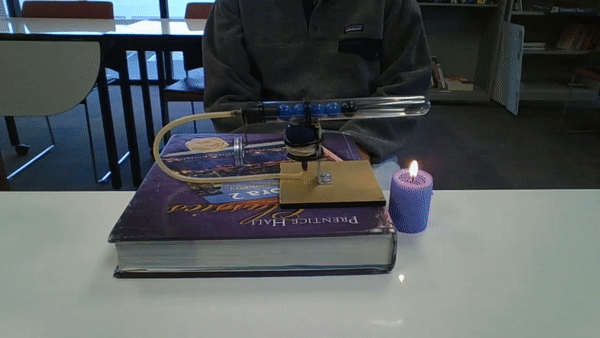

Hello all this is my semester 1 project README.md

My objective:

DIY Stirling Engine 
Objective: Create my own designed Stirling engine.

I will be using a 26 dollar set from amazon as my framework. From that set I will collect my own tools and materials and design my own engine.
I will be planning on using the lab laser cutter and 3D printer to create case of some sorts for the engine. 
I plan on using the Arduino to create a system that can measure temperature, RPM, and possibly other interesting measurements of my engine (need you help for this part). 

