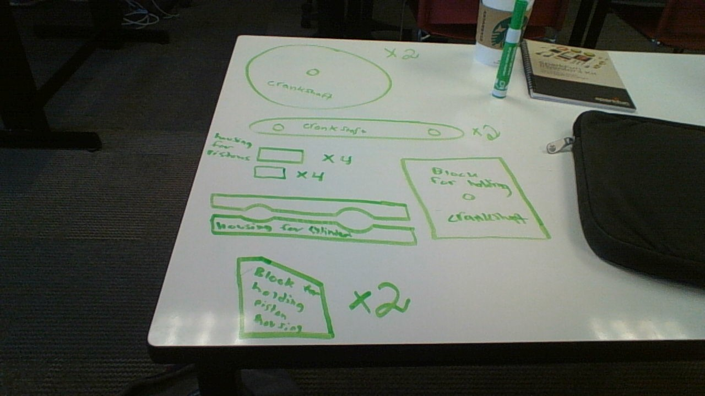

Hello all this is my semester 1 project README.md

My objective:

DIY Stirling Engine 
Objective: Create my own designed Stirling engine.

I will be using a 26 dollar set from amazon as my framework. From that set I will collect my own tools and materials and design my own engine.
I will be planning on using the lab laser cutter and 3D printer to create case of some sorts for the engine. 
I plan on using the Arduino to create a system that can measure temperature, RPM, and possibly other interesting measurements of my engine (need you help for this part). 

After creating and generating some ideas from the model sterling engine I was ready to start my own prototype (derived from the following youtube video https://www.youtube.com/watch?v=Jk7Qn0aIE2c&t=0s&list=LLxRfzWlgLrxnCrF-a1ZqZ1w&index=2). Here is the list of acrylic printouts I came up with. 

All the .svg files, in my project hub, contain the needed information such as: size, porportions, measurments, etc..... for my sterling engine. All these files were created and modified on inkscape and printed on a trotec lasercutter. The material of all the following parts is acrylic. 
